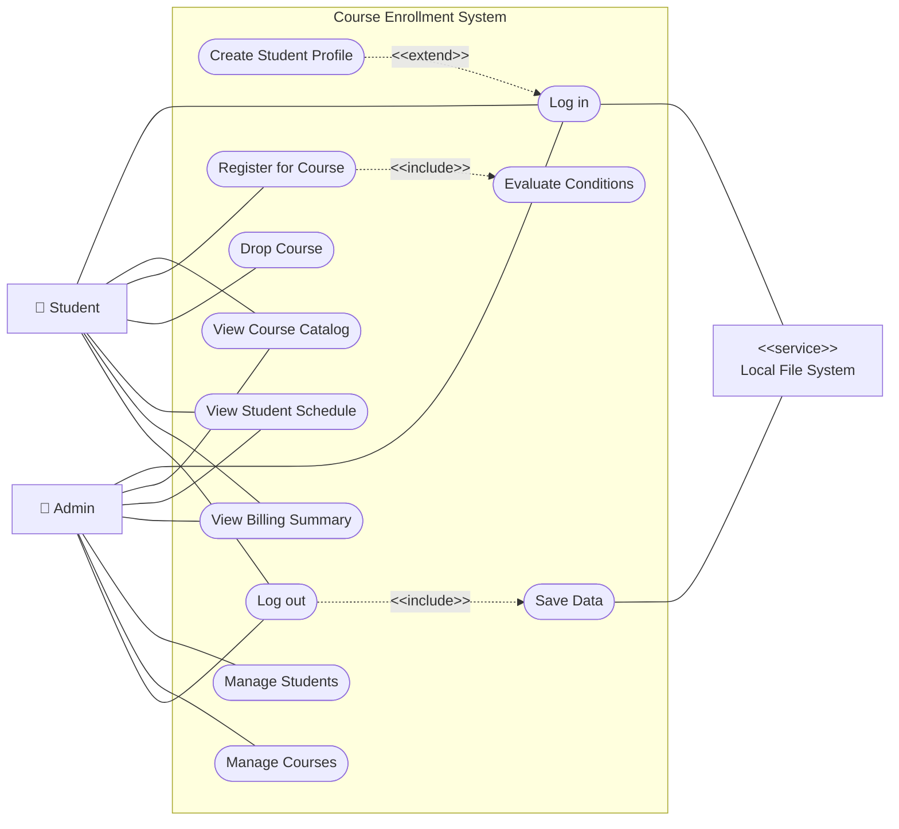
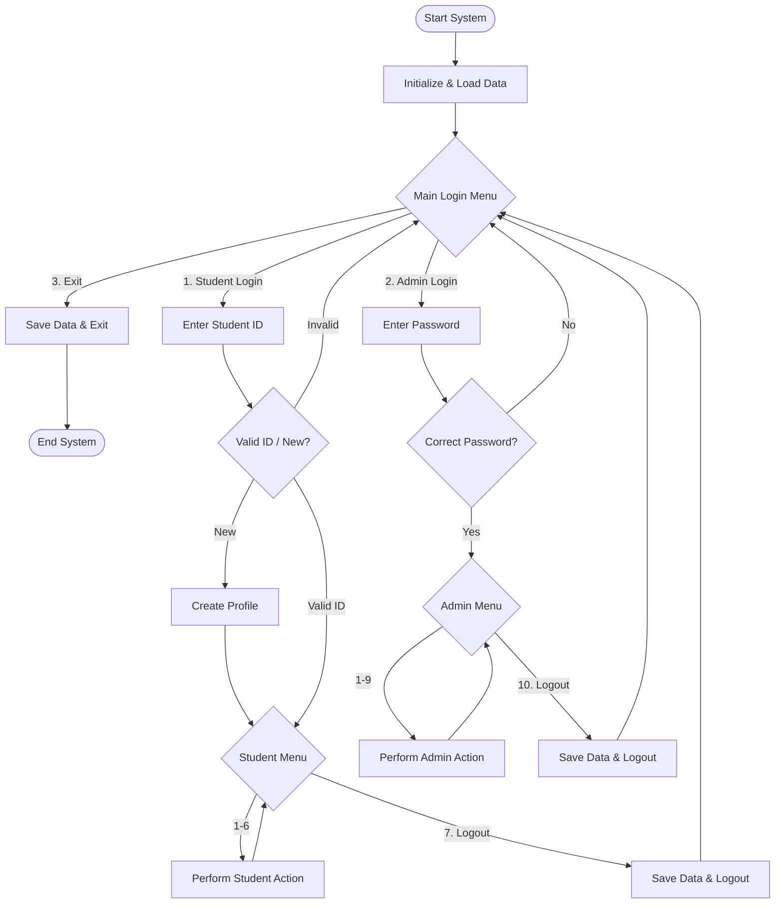

# unknownapp
This is an unknown application written in Java

---- For Submission (you must fill in the information below) ----
### Use Case Diagram

### Flowchart of the main workflow

### Prompts

1. "Try to execute it, read the code, and understand what the program does."
2. "Create a use case diagram that shows the program's functionality. Put the use case diagram in the README.md"
3. Based on what you understand about the program Explain the program to me in Thai
4. "- Based on what you understand about the program, select one use case and create an equivalent Python version of the program. Put the Python program in a new folder called “python.” You can use AI to help you on this, but you must put the prompts you used in the README.md under the section “# Prompts.” on file README.md

   - I select the login case.

